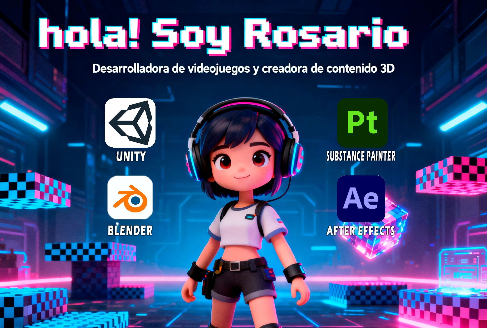

### ¡Hola! Soy Rosario 👋  
Desarrolladora de videojuegos y creadora de contenido 3D.  
Titulada en **Animación 3D, Juegos y Entornos Interactivos** y en el **Curso de Especialización en Desarrollo de Videojuegos y Realidad Virtual**.  

Me apasiona diseñar experiencias inmersivas e interactivas, dando vida a ideas mediante **Unity**, **C#**, **Substance Painter**, **After Effects** y **Blender**.  

Actualmente trabajo en proyectos personales y colaborativos.

### 🚀 Tecnologías y herramientas:

### 🎮 Proyectos de videojuegos:
- [Proyecto 1](https://github.com/R0S4RI0/Breakout-Arkanoid) - Breakout / Arkanoid
- [Proyecto 2](https://github.com/R0S4RI0/SuperMarioBrosMDRNES.git) - Un juego 2D de plataformas creado en Unity.
- [Proyecto 3](https://github.com/Overlocker96/Shooter-Sci-Fi.git)  - Shooter-Sci-Fi un juego en 3D utilizando Unity colaborativo.

### 🌐 Encuéntrame en:

### 📊 Estadísticas de GitHub

