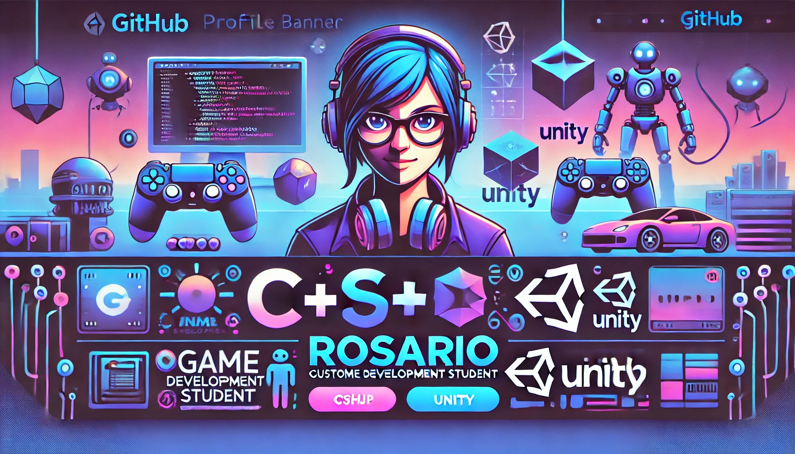

### ¡Hola! Soy Rosario 👋
Estudiante de desarrollo de videojuegos, apasionada por la creación de experiencias interactivas y la programación. Actualmente enfocada en aprender sobre **Unity** y **C#** para crear juegos emocionantes.

### 🚀 Tecnologías y herramientas:
 
 
 

### 🎮 Proyectos de videojuegos:
- [Proyecto 1](https://github.com/tuusuario/proyecto1) - Un juego 2D de plataformas creado en Unity.
- [Proyecto 2](https://github.com/tuusuario/proyecto2) - Un juego de aventuras 3D utilizando Unreal Engine.

### 🌐 Encuéntrame en:

### 📊 Estadísticas de GitHub:

